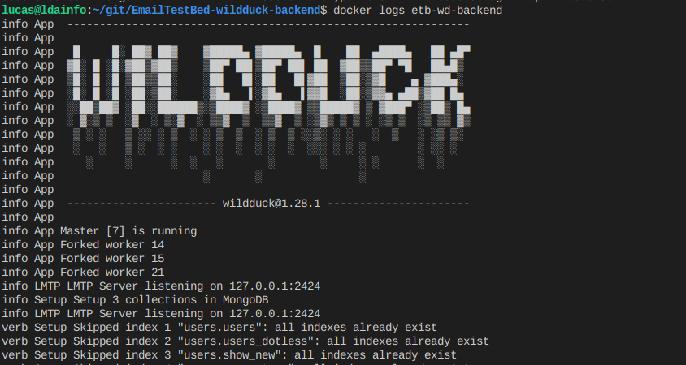

# EmailTestBed-wildduck-backend

This is the backend project and it's based on wildduck project. The wildduck is a complete email suite. 

## Tech stask
- Main language, node.js
- Rest apis
- Database layer - mongodb - mongodb.com
- Caching - redis - redis.io

## Source folder

- All source files are available in `/lib` folder. Here is where the original source from wildduck's backend is stored.
- The aditional endpoints created to customize the wildduck are available in `/lib/etb` folder.

### ETB aditional endpoints

These endpoints are responsible to create the data used during the simulation.

#### **/a/company**

This allow create a company and list companies already created in the database. Use the PUT opration to create a new company and the GET to list the companies available on DB.

##### PUT SAMPLE
`
{
        "companyName": "Cog Industries",
        "companyDomain": "cogind.com",
        "jobTitle": "coordinator1",
        "form1Type": "scy clearence",
        "form2Type": "legal",
        "form3Type": "hire",
        "fileExtNormal": "pdf",
        "fileExtAttack": "exe",
        "fileName": "{{lastName}}_{{personId}}_{{formType}}_{{fileExt}}",
        "reportBtLabel": "Report"
}

#### **/a/person**

This allow create a person that represents who will send the email also list persons already created in the database. Use the PUT operation to create a new person and the GET to list the persons available on DB.

##### PUT SAMPLE
`
{
    "email" : "u1@email.com",
    "firstName" : "User 1",
    "gender" : "FEMALE",
    "lastName" : "lastName 1",
    "salutation" : "Hi... {{firstName}} {{lastName}}",
    "signature" : "Thanks",
    "suspiciousFlag" : true,
    "title" : "Mrs"
}
`

#### **/a/message**

Allow create the messages that will be sent do the user. PUT operation to create a new one and GET to list all messages on db.

##### PUT SAMPLE
`
{
    "subject" : "Subject 1 - Hi from {{firstName}}",
    "body" : "{{firstName}} {{lastName}} forgot to give me {{hisher}} file",
    "goal" : "D",
    "suspiciousFlag" : false,
    "voice" : "1"
}
`

#### **/a/script**

This is used to create the messages that will be send to a user. It expects a list os `steps` and each step requires an personId and a messageId to use as reference of these objects on database. The put operation will create a new script and the GET will list operations already available on db.

##### PUT SAMPLE
{
    "email": "etb@emailtestbed.xyz",
    "steps": [
        {
            "personId": "5fea0cf9a9e4a0b46c60253d",
            "messageId": "5fea0d2fa9e4a0b46c60259e",
            "attackFlag": true,
            "formType": 1
        },
        {
            "personId": "5fea0d01a9e4a0b46c602549",
            "messageId": "5fea0d33a9e4a0b46c6025a9",
            "attackFlag": false,
            "formType": 2
        },
        {
            "personId": "5fea0d0ba9e4a0b46c60255b",
            "messageId": "5fea0d36a9e4a0b46c6025b1",
            "attackFlag": true,
            "formType": 1
        },
        {
            "personId": "5fea0d18a9e4a0b46c602577",
            "messageId": "5fea0d3aa9e4a0b46c6025bd",
            "attackFlag": false,
            "formType": 2
        },
        {
            "personId": "5fea0d20a9e4a0b46c602583",
            "messageId": "5fea0d3da9e4a0b46c6025bf",
            "attackFlag": true,
            "formType": 1
        }
    ]
}

## How to start

You can run the project using the node.js (v14) installed in your machine or using docker / docker-compose

# Run using node.js

1. First, donwload it from the https://nodejs.org/en/download/. It's compatible with node 12 and 14. Probably other versions
will be compatible too but I didn't test.
2. Other option to install node is using nvm (node version manager). This allow you easily switch between the nodejs versions. https://github.com/nvm-sh/nvm
3. commands to build and run the aplication locally:

#### Install the dependencies 

`npm install --production`

#### Run the application

`node server.js --config=config/default.toml`

4. If everything is ok, you can access the rest api on http://localhost:8080

## Atention

Using this method you will have to install mongodb and redis manually in you local environment.

----------
# Run using Docker

## Installing docker and docker-compose

### Docker

**Using this method it will automatically install run the etb backend app and also mongodb and redis.**

You should access https://docs.docker.com/get-docker/ and follow the instructions to install docker in your machine.

### Docker Compose

Docker compose is used as container orchestrator. Basically it will define how the containers must be configured.

To install, https://docs.docker.com/compose/install/

### Running the project locally

this command will build and run the application. The container name is `etb-wd-backend`

`docker-compose -f docker/docker-compose-local.yml up --build --force-recreate`

Alternatively you can use the `-d` switch to run the project in daemon mode.

`docker-compose -f docker/docker-compose-local.yml up --build --force-recreate -d`

**Docker commands:**

Check running containers:
`docker ps`

Check logs:
`docker logs -f --tail 1000 etb-ed-backend`

Stop container:
`docker stop etb-ed-backend`

Start container:
`docker start etb-ed-backend`

Restart container:
`docker restart etb-ed-backend`

# Language

English

# Preview

